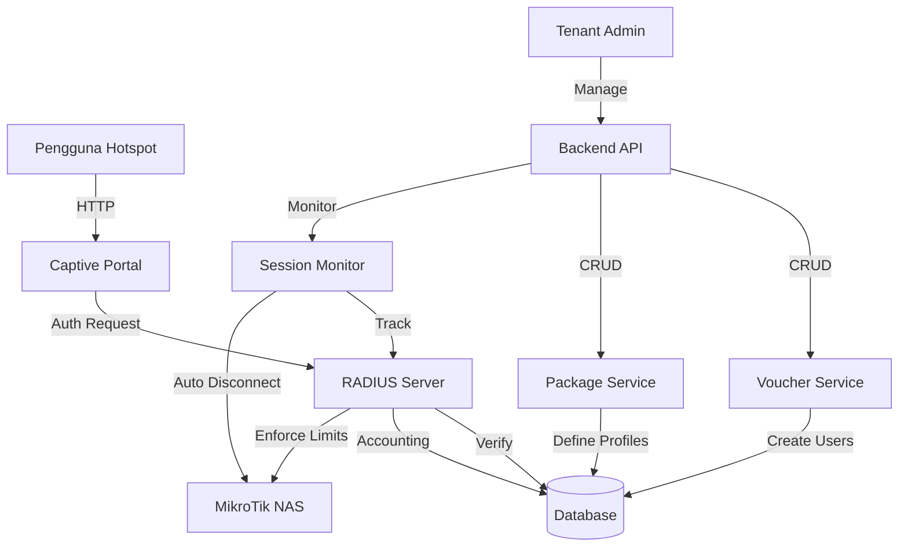
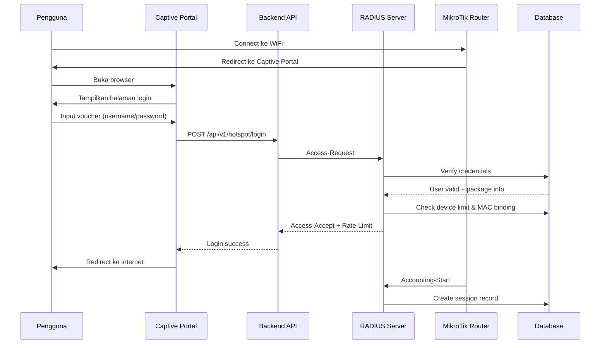

# Design Document - Sistem Hotspot Voucher

## Ringkasan

Sistem Hotspot Voucher adalah fitur yang memungkinkan tenant RT/RW Net untuk mengelola akses WiFi hotspot berbasis voucher. Sistem ini terintegrasi dengan RADIUS server yang sudah ada (menggunakan layeh/radius) dan menambahkan layer manajemen voucher, paket durasi, captive portal, dan monitoring real-time.

## Arsitektur

### Komponen Utama

1. **Hotspot Package Service** - Mengelola paket hotspot (durasi, bandwidth, harga)
2. **Voucher Service** - Generate dan kelola voucher
3. **Captive Portal Service** - Halaman login hotspot dengan branding tenant
4. **RADIUS Integration** - Extend RADIUS server yang ada untuk hotspot
5. **Session Monitor Service** - Tracking sesi aktif dan auto-disconnect
6. **Billing Service** - Tracking penjualan dan revenue voucher

### Diagram Arsitektur



### Flow Autentikasi Hotspot



## Komponen dan Interface

### 1. Domain Entities

#### HotspotPackage
```go
type HotspotPackage struct {
    ID              uuid.UUID
    TenantID        string
    Name            string
    Description     string
    DurationType    string  // "hours", "days"
    Duration        int     // jumlah jam/hari
    Price           int     // harga dalam rupiah
    SpeedUpload     int     // kbps
    SpeedDownload   int     // kbps
    DeviceLimit     int     // 1-2 devices
    MACBinding      bool    // enforce MAC address binding
    SessionLimit    int     // concurrent sessions
    IsActive        bool
    CreatedAt       time.Time
    UpdatedAt       time.Time
}
```

#### HotspotVoucher
```go
type HotspotVoucher struct {
    ID              uuid.UUID
    TenantID        string
    PackageID       uuid.UUID
    RadiusUserID    *uuid.UUID  // link ke radius_users
    VoucherCode     string      // username untuk login
    VoucherPassword string      // password untuk login
    Status          string      // "unused", "active", "expired", "used"
    ActivatedAt     *time.Time  // waktu pertama kali login
    ExpiresAt       *time.Time  // calculated: ActivatedAt + Duration
    DeviceMAC       string      // MAC address yang terikat
    CreatedAt       time.Time
    UpdatedAt       time.Time
    
    // Relations
    Package         *HotspotPackage
    RadiusUser      *RadiusUser
}
```

#### CaptivePortalSettings
```go
type CaptivePortalSettings struct {
    ID              uuid.UUID
    TenantID        string
    LogoURL         string
    PromotionalText string
    RedirectURL     string
    PrimaryColor    string
    SecondaryColor  string
    UpdatedAt       time.Time
}
```

#### HotspotSession (View dari RadiusAccounting)
```go
type HotspotSession struct {
    SessionID       string
    Username        string
    IPAddress       string
    MACAddress      string
    StartTime       time.Time
    Duration        int     // seconds
    UploadBytes     int64
    DownloadBytes   int64
    PackageName     string
    Status          string  // "active", "expired", "disconnected"
}
```

### 2. Repository Interfaces

```go
type HotspotPackageRepository interface {
    Create(ctx context.Context, pkg *HotspotPackage) error
    FindByID(ctx context.Context, id string) (*HotspotPackage, error)
    FindByTenantID(ctx context.Context, tenantID string) ([]*HotspotPackage, error)
    Update(ctx context.Context, pkg *HotspotPackage) error
    Delete(ctx context.Context, id string) error
}

type HotspotVoucherRepository interface {
    Create(ctx context.Context, voucher *HotspotVoucher) error
    CreateBatch(ctx context.Context, vouchers []*HotspotVoucher) error
    FindByID(ctx context.Context, id string) (*HotspotVoucher, error)
    FindByCode(ctx context.Context, tenantID, code string) (*HotspotVoucher, error)
    FindByTenantID(ctx context.Context, tenantID string, filters map[string]interface{}) ([]*HotspotVoucher, int, error)
    Update(ctx context.Context, voucher *HotspotVoucher) error
    Delete(ctx context.Context, id string) error
    CountByStatus(ctx context.Context, tenantID, status string) (int, error)
    CountByPackageAndDateRange(ctx context.Context, tenantID, packageID string, start, end time.Time) (int, error)
}

type CaptivePortalRepository interface {
    GetSettings(ctx context.Context, tenantID string) (*CaptivePortalSettings, error)
    UpsertSettings(ctx context.Context, settings *CaptivePortalSettings) error
}
```

### 3. Service Interfaces

```go
type HotspotPackageService interface {
    CreatePackage(ctx context.Context, tenantID string, req *CreatePackageRequest) (*HotspotPackage, error)
    ListPackages(ctx context.Context, tenantID string) ([]*HotspotPackage, error)
    GetPackage(ctx context.Context, tenantID, packageID string) (*HotspotPackage, error)
    UpdatePackage(ctx context.Context, tenantID, packageID string, req *UpdatePackageRequest) error
    DeletePackage(ctx context.Context, tenantID, packageID string) error
}

type HotspotVoucherService interface {
    GenerateVouchers(ctx context.Context, tenantID string, req *GenerateVouchersRequest) ([]*HotspotVoucher, error)
    ListVouchers(ctx context.Context, tenantID string, filters map[string]interface{}, page, perPage int) ([]*HotspotVoucher, int, error)
    GetVoucher(ctx context.Context, tenantID, voucherID string) (*HotspotVoucher, error)
    DeleteVoucher(ctx context.Context, tenantID, voucherID string) error
    ActivateVoucher(ctx context.Context, tenantID, voucherCode, macAddress string) error
    GetVoucherStats(ctx context.Context, tenantID string, startDate, endDate time.Time) (*VoucherStats, error)
}

type CaptivePortalService interface {
    GetPortalSettings(ctx context.Context, tenantID string) (*CaptivePortalSettings, error)
    UpdatePortalSettings(ctx context.Context, tenantID string, req *UpdatePortalSettingsRequest) error
    AuthenticateUser(ctx context.Context, nasIP, username, password, macAddress string) (*AuthResponse, error)
}

type HotspotSessionService interface {
    GetActiveSessions(ctx context.Context, tenantID string) ([]*HotspotSession, error)
    DisconnectSession(ctx context.Context, tenantID, sessionID string) error
    CheckExpiredSessions(ctx context.Context) error  // background job
}
```

## Model Data

### Database Schema

#### Tabel: hotspot_packages
```sql
CREATE TABLE hotspot_packages (
    id UUID PRIMARY KEY DEFAULT gen_random_uuid(),
    tenant_id UUID NOT NULL REFERENCES tenants(id),
    name VARCHAR(100) NOT NULL,
    description TEXT,
    duration_type VARCHAR(20) NOT NULL, -- 'hours' or 'days'
    duration INT NOT NULL,
    price INT NOT NULL DEFAULT 0,
    speed_upload INT NOT NULL, -- kbps
    speed_download INT NOT NULL, -- kbps
    device_limit INT NOT NULL DEFAULT 1,
    mac_binding BOOLEAN DEFAULT false,
    session_limit INT DEFAULT 1,
    is_active BOOLEAN DEFAULT true,
    created_at TIMESTAMP DEFAULT NOW(),
    updated_at TIMESTAMP DEFAULT NOW(),
    UNIQUE(tenant_id, name)
);
```

#### Tabel: hotspot_vouchers
```sql
CREATE TABLE hotspot_vouchers (
    id UUID PRIMARY KEY DEFAULT gen_random_uuid(),
    tenant_id UUID NOT NULL REFERENCES tenants(id),
    package_id UUID NOT NULL REFERENCES hotspot_packages(id),
    radius_user_id UUID REFERENCES radius_users(id),
    voucher_code VARCHAR(50) NOT NULL,
    voucher_password VARCHAR(50) NOT NULL,
    status VARCHAR(20) DEFAULT 'unused', -- 'unused', 'active', 'expired', 'used'
    activated_at TIMESTAMP,
    expires_at TIMESTAMP,
    device_mac VARCHAR(17),
    created_at TIMESTAMP DEFAULT NOW(),
    updated_at TIMESTAMP DEFAULT NOW(),
    UNIQUE(tenant_id, voucher_code),
    INDEX idx_status (tenant_id, status),
    INDEX idx_package (package_id),
    INDEX idx_expires (expires_at)
);
```

#### Tabel: captive_portal_settings
```sql
CREATE TABLE captive_portal_settings (
    id UUID PRIMARY KEY DEFAULT gen_random_uuid(),
    tenant_id UUID NOT NULL UNIQUE REFERENCES tenants(id),
    logo_url TEXT,
    promotional_text TEXT,
    redirect_url TEXT,
    primary_color VARCHAR(7) DEFAULT '#3B82F6',
    secondary_color VARCHAR(7) DEFAULT '#10B981',
    updated_at TIMESTAMP DEFAULT NOW()
);
```

### Relasi dengan Tabel yang Sudah Ada

- `hotspot_vouchers.radius_user_id` → `radius_users.id`
- `hotspot_packages.tenant_id` → `tenants.id`
- RADIUS server akan menggunakan `radius_users` yang di-generate dari voucher

## Error Handling

### Error Codes

```go
const (
    ErrVoucherNotFound      = "VOUCHER_NOT_FOUND"
    ErrVoucherExpired       = "VOUCHER_EXPIRED"
    ErrVoucherAlreadyUsed   = "VOUCHER_ALREADY_USED"
    ErrDeviceLimitExceeded  = "DEVICE_LIMIT_EXCEEDED"
    ErrMACBindingViolation  = "MAC_BINDING_VIOLATION"
    ErrSessionLimitExceeded = "SESSION_LIMIT_EXCEEDED"
    ErrPackageNotFound      = "PACKAGE_NOT_FOUND"
    ErrPackageInUse         = "PACKAGE_IN_USE"
    ErrInvalidDuration      = "INVALID_DURATION"
    ErrDuplicateVoucher     = "DUPLICATE_VOUCHER"
)
```

### Error Response Format

```json
{
    "error": {
        "code": "VOUCHER_EXPIRED",
        "message": "Voucher Anda telah kedaluwarsa",
        "details": {
            "expired_at": "2024-01-15T10:30:00Z"
        }
    }
}
```

## Strategi Testing

### Unit Testing

Framework: Go testing package dengan testify/assert

**Test Coverage:**
1. Package Service
   - Create package dengan berbagai durasi
   - Validasi input (durasi negatif, bandwidth invalid)
   - Update package yang sedang digunakan
   - Delete package yang memiliki voucher aktif

2. Voucher Service
   - Generate voucher batch
   - Uniqueness voucher code dalam tenant
   - Aktivasi voucher pertama kali
   - Validasi MAC binding
   - Validasi device limit

3. Captive Portal Service
   - Autentikasi dengan voucher valid
   - Autentikasi dengan voucher expired
   - Autentikasi dengan MAC address berbeda (MAC binding)
   - Autentikasi melebihi device limit

4. Session Service
   - Tracking sesi aktif
   - Disconnect sesi
   - Check expired sessions

### Property-Based Testing

Framework: **gopter** (Go property-based testing library)

Konfigurasi: Minimum 100 iterasi per property test

**Property Tests akan dibuat untuk:**


## Correctness Properties

*A property is a characteristic or behavior that should hold true across all valid executions of a system-essentially, a formal statement about what the system should do. Properties serve as the bridge between human-readable specifications and machine-verifiable correctness guarantees.*

### Property 1: User creation associates with package
*Untuk semua* kombinasi username, password, dan package ID yang valid, ketika user hotspot dibuat, maka user tersebut harus tersimpan di database dan terasosiasi dengan package yang ditentukan
**Validates: Requirements 1.1**

### Property 2: User deletion terminates sessions
*Untuk semua* user hotspot yang memiliki sesi aktif, ketika user dihapus, maka user harus hilang dari database dan semua sesi aktif harus terminated
**Validates: Requirements 1.2**

### Property 3: Device limit invariant
*Untuk semua* user hotspot yang dibuat, device_limit harus bernilai antara 1 dan 2
**Validates: Requirements 1.3**

### Property 4: Expired package disables user
*Untuk semua* user hotspot dengan expire_date di masa lalu, is_active harus bernilai false
**Validates: Requirements 1.4**

### Property 5: User list completeness
*Untuk semua* item dalam response list users, setiap item harus memiliki field username, package, expire_date, device_count, dan status
**Validates: Requirements 1.5**

### Property 6: Voucher username uniqueness
*Untuk semua* voucher yang di-generate dalam satu batch, semua voucher_code harus unik
**Validates: Requirements 2.1, 2.2**

### Property 7: Voucher package association
*Untuk semua* voucher yang dibuat, voucher harus memiliki package_id yang valid dan package tersebut harus memiliki duration_type yang valid ("hours" atau "days")
**Validates: Requirements 2.4**

### Property 8: Voucher response completeness
*Untuk semua* voucher dalam response list, setiap voucher harus memiliki field voucher_code, package, status, dan expires_at
**Validates: Requirements 2.5**

### Property 9: Package creation completeness
*Untuk semua* package yang dibuat dengan nama, durasi, dan bandwidth, package harus tersimpan dengan semua field tersebut
**Validates: Requirements 3.1, 3.3**

### Property 10: Expiration calculation correctness
*Untuk semua* voucher yang diaktivasi, expires_at harus sama dengan activated_at ditambah duration dari package
**Validates: Requirements 3.2**

### Property 11: Expired voucher authentication rejection
*Untuk semua* voucher dengan expires_at di masa lalu, upaya autentikasi harus ditolak dengan Access-Reject
**Validates: Requirements 3.4**

### Property 12: Package update isolation
*Untuk semua* package yang di-update, perubahan tidak boleh mempengaruhi voucher yang sudah active (status = "active")
**Validates: Requirements 3.5**

### Property 13: Valid credentials authentication
*Untuk semua* voucher dengan status "active" dan expires_at di masa depan, autentikasi dengan credentials yang benar harus berhasil
**Validates: Requirements 4.2, 6.1, 6.2**

### Property 14: Invalid credentials rejection
*Untuk semua* kombinasi username/password yang tidak cocok dengan voucher aktif, autentikasi harus ditolak
**Validates: Requirements 4.3, 6.3**

### Property 15: Authentication response contains redirect
*Untuk semua* autentikasi yang berhasil, response harus mengandung redirect_url
**Validates: Requirements 4.4**

### Property 16: Portal displays tenant branding
*Untuk semua* request ke captive portal dengan NAS identifier, response harus mengandung logo_url dan promotional_text dari tenant yang sesuai
**Validates: Requirements 4.5, 5.5**

### Property 17: Portal settings persistence
*Untuk semua* portal settings yang di-update (logo, text, redirect URL), settings harus tersimpan dan muncul di portal response berikutnya
**Validates: Requirements 5.1, 5.2, 5.3, 5.4**

### Property 18: Device limit enforcement
*Untuk semua* user dengan 2 active sessions, upaya autentikasi dari MAC address ketiga harus ditolak
**Validates: Requirements 6.4**

### Property 19: MAC address recording
*Untuk semua* autentikasi yang berhasil, MAC address harus tercatat di session record
**Validates: Requirements 6.5**

### Property 20: Access-Accept includes bandwidth attributes
*Untuk semua* Access-Accept response, response harus mengandung Mikrotik-Rate-Limit attribute dengan format "upload/download" dalam bps
**Validates: Requirements 7.1, 7.2, 7.3**

### Property 21: No active package rejection
*Untuk semua* user tanpa package_id atau dengan package yang is_active = false, autentikasi harus ditolak
**Validates: Requirements 7.5**

### Property 22: Accounting-Start creates session record
*Untuk semua* Accounting-Start packet, harus dibuat session record dengan start_time, username, IP, dan MAC address
**Validates: Requirements 8.1**

### Property 23: Accounting-Interim updates session
*Untuk semua* Accounting-Interim-Update packet, session record harus di-update dengan bytes transferred dan duration
**Validates: Requirements 8.2**

### Property 24: Accounting-Stop closes session
*Untuk semua* Accounting-Stop packet, session record harus di-update dengan stop_time, total duration, dan total bytes
**Validates: Requirements 8.3**

### Property 25: Session duration expiration
*Untuk semua* session dengan duration melebihi package duration, user harus ditandai expired dan autentikasi berikutnya ditolak
**Validates: Requirements 8.4**

### Property 26: Accounting data persistence
*Untuk semua* accounting packet (Start, Interim, Stop), data harus tersimpan di database
**Validates: Requirements 8.5**

### Property 27: Active sessions tenant isolation
*Untuk semua* tenant, query active sessions hanya mengembalikan session dengan tenant_id yang sesuai
**Validates: Requirements 9.1, 12.3**

### Property 28: Session response completeness
*Untuk semua* active session dalam response, setiap session harus memiliki username, IP, MAC, duration, dan bytes transferred
**Validates: Requirements 9.2**

### Property 29: Session duration format
*Untuk semua* session duration yang ditampilkan, format harus "HH:MM:SS"
**Validates: Requirements 9.5**

### Property 30: Disconnect updates session status
*Untuk semua* session yang di-disconnect, status session harus berubah menjadi "disconnected" di database
**Validates: Requirements 10.3**

### Property 31: Disconnected user re-authentication
*Untuk semua* user yang di-disconnect dengan voucher masih valid (expires_at > now), re-authentication harus diizinkan
**Validates: Requirements 10.4**

### Property 32: Disconnect error handling
*Untuk semua* operasi disconnect yang gagal, harus return error response
**Validates: Requirements 10.5**

### Property 33: Voucher sales aggregation
*Untuk semua* package, count voucher yang terjual harus sama dengan jumlah voucher dengan status "active" atau "used" untuk package tersebut
**Validates: Requirements 11.1**

### Property 34: Voucher status categorization
*Untuk semua* voucher, status harus salah satu dari: "unused", "active", "expired", "used"
**Validates: Requirements 11.2**

### Property 35: Date range filtering
*Untuk semua* query dengan start_date dan end_date, hanya voucher dengan created_at dalam range tersebut yang dikembalikan
**Validates: Requirements 11.3**

### Property 36: Revenue calculation correctness
*Untuk semua* package, revenue = (count voucher dengan status "active" atau "used") * package.price
**Validates: Requirements 11.4**

### Property 37: Activation timestamp recording
*Untuk semua* voucher yang pertama kali digunakan, activated_at harus tercatat dengan timestamp saat autentikasi pertama
**Validates: Requirements 11.5**

### Property 38: User tenant association
*Untuk semua* hotspot user yang dibuat, tenant_id harus ada dan tidak null
**Validates: Requirements 12.1**

### Property 39: NAS-based tenant identification
*Untuk semua* autentikasi request, tenant harus diidentifikasi dari NAS shared secret yang cocok
**Validates: Requirements 12.2, 12.4**

### Property 40: Row-level security enforcement
*Untuk semua* query data (users, vouchers, sessions), hanya data dengan tenant_id yang sesuai dengan authenticated tenant yang dikembalikan
**Validates: Requirements 12.5**

### Property 41: NAS configuration persistence
*Untuk semua* NAS yang ditambahkan dengan IP dan shared secret, konfigurasi harus tersimpan di database
**Validates: Requirements 13.1**

### Property 42: NAS secret validation
*Untuk semua* RADIUS request dari NAS, shared secret harus diverifikasi cocok dengan konfigurasi
**Validates: Requirements 13.2**

### Property 43: Wrong secret rejection
*Untuk semua* RADIUS request dengan shared secret yang salah, request harus ditolak
**Validates: Requirements 13.3**

### Property 44: NAS secret update propagation
*Untuk semua* NAS yang di-update secretnya, RADIUS request berikutnya harus menggunakan secret baru
**Validates: Requirements 13.4**

### Property 45: Deleted NAS rejection
*Untuk semua* NAS yang dihapus, RADIUS request dari IP NAS tersebut harus ditolak
**Validates: Requirements 13.5**

### Property 46: First authentication MAC recording
*Untuk semua* user yang pertama kali autentikasi, MAC address harus tercatat di user record
**Validates: Requirements 14.1**

### Property 47: MAC binding enforcement
*Untuk semua* user dengan MAC address terikat dan package dengan mac_binding = true, autentikasi dari MAC berbeda harus ditolak
**Validates: Requirements 14.2, 14.3**

### Property 48: MAC binding toggle
*Untuk semua* package dengan mac_binding = false, autentikasi dari MAC address apa pun harus diizinkan hingga device_limit
**Validates: Requirements 14.4**

### Property 49: Bound MAC display
*Untuk semua* user dengan MAC address terikat, MAC address harus muncul di user details response
**Validates: Requirements 14.5**

### Property 50: Session expiration marking
*Untuk semua* session dengan (current_time - start_time) > package.duration, session harus ditandai sebagai expired
**Validates: Requirements 15.1**

### Property 51: Expired session auto-disconnect
*Untuk semua* session yang ditandai expired, disconnect request harus dikirim ke NAS
**Validates: Requirements 15.2**

### Property 52: Expired voucher re-authentication prevention
*Untuk semua* voucher dengan status "expired", upaya autentikasi harus ditolak dengan Access-Reject
**Validates: Requirements 15.4, 15.5**

### Property 53: Session limit enforcement
*Untuk semua* user dengan active_session_count >= package.session_limit, autentikasi baru harus ditolak
**Validates: Requirements 16.1, 16.2**

### Property 54: Session count decrement
*Untuk semua* session yang berakhir (Accounting-Stop), active_session_count untuk user tersebut harus berkurang 1
**Validates: Requirements 16.3**

### Property 55: Package session limit application
*Untuk semua* user dengan package tertentu, session_limit dari package harus diterapkan
**Validates: Requirements 16.4**

### Property 56: Session count display
*Untuk semua* user dalam monitoring view, response harus menampilkan current_session_count dan session_limit
**Validates: Requirements 16.5**

## Strategi Testing (lanjutan)

### Property-Based Testing dengan Gopter

**Generators yang Diperlukan:**

1. **Package Generator**
```go
func genHotspotPackage() gopter.Gen {
    return gopter.CombineGens(
        gen.AlphaString(),           // name
        gen.IntRange(1, 24),         // duration hours
        gen.IntRange(1000, 10000),   // speed kbps
        gen.IntRange(1, 2),          // device limit
        gen.Bool(),                  // mac_binding
    ).Map(func(vals []interface{}) *HotspotPackage {
        return &HotspotPackage{
            Name:          vals[0].(string),
            DurationType:  "hours",
            Duration:      vals[1].(int),
            SpeedUpload:   vals[2].(int),
            SpeedDownload: vals[2].(int) * 2,
            DeviceLimit:   vals[3].(int),
            MACBinding:    vals[4].(bool),
        }
    })
}
```

2. **Voucher Generator**
```go
func genVoucher(packageID string) gopter.Gen {
    return gopter.CombineGens(
        gen.AlphaString(),
        gen.AlphaString(),
    ).Map(func(vals []interface{}) *HotspotVoucher {
        return &HotspotVoucher{
            PackageID:       packageID,
            VoucherCode:     vals[0].(string),
            VoucherPassword: vals[1].(string),
            Status:          "unused",
        }
    })
}
```

3. **MAC Address Generator**
```go
func genMACAddress() gopter.Gen {
    return gen.SliceOfN(6, gen.IntRange(0, 255)).Map(func(bytes []int) string {
        return fmt.Sprintf("%02x:%02x:%02x:%02x:%02x:%02x",
            bytes[0], bytes[1], bytes[2], bytes[3], bytes[4], bytes[5])
    })
}
```

**Contoh Property Test:**

```go
// Property 6: Voucher username uniqueness
func TestProperty_VoucherUniqueness(t *testing.T) {
    properties := gopter.NewProperties(nil)
    
    properties.Property("all vouchers in batch have unique codes", prop.ForAll(
        func(count int, packageID string) bool {
            vouchers := generateVoucherBatch(count, packageID)
            codes := make(map[string]bool)
            for _, v := range vouchers {
                if codes[v.VoucherCode] {
                    return false // duplicate found
                }
                codes[v.VoucherCode] = true
            }
            return true
        },
        gen.IntRange(1, 100),
        gen.UUIDString(),
    ))
    
    properties.TestingRun(t, gopter.ConsoleReporter(false))
}
```

### Integration Testing

**Test Scenarios:**
1. End-to-end flow: Generate voucher → Login via captive portal → Session tracking → Auto-disconnect
2. Multi-tenant isolation: Verify tenant A cannot access tenant B's vouchers
3. RADIUS integration: Test authentication, authorization, dan accounting flow
4. MAC binding: Test device limit dan MAC address enforcement
5. Session expiration: Test auto-disconnect expired sessions

### Load Testing

**Scenarios:**
- 100 concurrent voucher generations
- 1000 concurrent RADIUS authentication requests
- 500 active sessions dengan accounting updates setiap 60 detik

## API Endpoints

### Hotspot Package Management

```
POST   /api/v1/tenant/hotspot/packages
GET    /api/v1/tenant/hotspot/packages
GET    /api/v1/tenant/hotspot/packages/:id
PUT    /api/v1/tenant/hotspot/packages/:id
DELETE /api/v1/tenant/hotspot/packages/:id
```

### Voucher Management

```
POST   /api/v1/tenant/hotspot/vouchers/generate
GET    /api/v1/tenant/hotspot/vouchers
GET    /api/v1/tenant/hotspot/vouchers/:id
DELETE /api/v1/tenant/hotspot/vouchers/:id
GET    /api/v1/tenant/hotspot/vouchers/stats
```

### Captive Portal

```
GET    /api/v1/public/hotspot/portal/:tenant_id
POST   /api/v1/public/hotspot/login
GET    /api/v1/tenant/hotspot/portal/settings
PUT    /api/v1/tenant/hotspot/portal/settings
```

### Session Monitoring

```
GET    /api/v1/tenant/hotspot/sessions
POST   /api/v1/tenant/hotspot/sessions/:id/disconnect
```

### NAS Management

```
POST   /api/v1/tenant/hotspot/nas
GET    /api/v1/tenant/hotspot/nas
PUT    /api/v1/tenant/hotspot/nas/:id
DELETE /api/v1/tenant/hotspot/nas/:id
```

## Frontend Components

### User Dashboard (Tenant Admin)

**Pages:**
1. `/hotspot/packages` - Manajemen paket hotspot
2. `/hotspot/vouchers` - Generate dan kelola voucher
3. `/hotspot/sessions` - Monitoring sesi aktif real-time
4. `/hotspot/portal` - Kustomisasi captive portal
5. `/hotspot/nas` - Konfigurasi NAS devices
6. `/hotspot/reports` - Laporan penjualan dan usage

**Components:**
- `PackageForm` - Form create/edit package
- `VoucherGenerator` - Batch voucher generation
- `VoucherTable` - List voucher dengan filter
- `SessionMonitor` - Real-time active sessions
- `PortalCustomizer` - Upload logo, set text, colors
- `NASForm` - Add/edit NAS configuration

### Captive Portal (Public)

**Standalone React App:**
- Lightweight, fast loading
- Responsive design (mobile-first)
- Tenant branding (logo, colors, text)
- Login form dengan validation
- Success/error messages
- Auto-redirect setelah login

**URL Structure:**
```
https://portal.rtrwnet.com/:tenant_slug
```

## Background Jobs

### 1. Session Expiration Checker

**Frequency:** Setiap 60 detik

**Logic:**
```go
func CheckExpiredSessions() {
    // 1. Query all active sessions
    sessions := getActiveSessions()
    
    for _, session := range sessions {
        // 2. Get voucher and package info
        voucher := getVoucherByUsername(session.Username)
        package := getPackage(voucher.PackageID)
        
        // 3. Calculate if expired
        duration := time.Since(session.StartTime)
        maxDuration := calculateDuration(package)
        
        if duration > maxDuration {
            // 4. Mark as expired
            markVoucherExpired(voucher.ID)
            
            // 5. Send disconnect to NAS
            sendDisconnectRequest(session.NASIdentifier, session.SessionID)
            
            // 6. Update session status
            updateSessionStatus(session.ID, "expired")
        }
    }
}
```

### 2. Voucher Status Updater

**Frequency:** Setiap 5 menit

**Logic:**
- Update status voucher dari "active" ke "expired" jika expires_at < now
- Update status voucher dari "unused" ke "expired" jika created_at + validity_period < now

## Security Considerations

### 1. Tenant Isolation
- Semua query harus filter by tenant_id
- RADIUS authentication harus verify tenant dari NAS secret
- API endpoints harus validate tenant ownership

### 2. Voucher Security
- Password harus di-hash sebelum disimpan (bcrypt)
- Voucher code harus random dan unpredictable
- Rate limiting pada login endpoint (max 5 attempts per minute per IP)

### 3. RADIUS Security
- Shared secret harus strong (min 32 characters)
- RADIUS packets harus divalidasi authenticator
- Support RADIUS over TLS (future enhancement)

### 4. Session Security
- Session ID harus unique dan unpredictable
- Disconnect request harus authenticated
- MAC address spoofing detection

## Performance Optimization

### 1. Database Indexing
```sql
CREATE INDEX idx_vouchers_tenant_status ON hotspot_vouchers(tenant_id, status);
CREATE INDEX idx_vouchers_code ON hotspot_vouchers(voucher_code);
CREATE INDEX idx_sessions_active ON radius_accounting(tenant_id, acct_stop_time) WHERE acct_stop_time IS NULL;
CREATE INDEX idx_packages_tenant ON hotspot_packages(tenant_id, is_active);
```

### 2. Caching Strategy
- Cache portal settings per tenant (Redis, TTL 5 minutes)
- Cache package info (Redis, TTL 10 minutes)
- Cache NAS configuration (Redis, invalidate on update)

### 3. RADIUS Performance
- Connection pooling untuk database
- Async accounting packet processing
- Batch insert untuk accounting records

## Migration Strategy

### Phase 1: Database Schema
1. Create tables: hotspot_packages, hotspot_vouchers, captive_portal_settings
2. Add indexes
3. Seed default packages (optional)

### Phase 2: Backend Services
1. Implement repository layer
2. Implement service layer
3. Implement API handlers
4. Extend RADIUS server untuk hotspot authentication

### Phase 3: Frontend
1. Create hotspot management pages di UserDashboard
2. Build captive portal standalone app
3. Add navigation menu items

### Phase 4: Background Jobs
1. Implement session expiration checker
2. Implement voucher status updater
3. Setup cron jobs atau scheduler

### Phase 5: Testing & Deployment
1. Unit tests
2. Property-based tests
3. Integration tests
4. Staging deployment
5. Production deployment

## Monitoring & Observability

### Metrics to Track
- Total vouchers generated per tenant
- Active sessions count
- Authentication success/failure rate
- Average session duration
- Bandwidth usage per package
- Revenue per package type

### Logging
- RADIUS authentication attempts (success/failure)
- Voucher generation events
- Session start/stop events
- Disconnect requests
- Error events (with context)

### Alerts
- High authentication failure rate (> 20%)
- RADIUS server down
- Database connection issues
- Session expiration job failures

## Future Enhancements

1. **Voucher Printing**
   - Generate PDF voucher cards
   - Bulk print dengan QR code

2. **Advanced Reporting**
   - Revenue analytics
   - Peak usage hours
   - Customer behavior analysis

3. **Payment Integration**
   - Online voucher purchase
   - Integration dengan Midtrans

4. **Mobile App**
   - Customer self-service app
   - Voucher purchase dan activation

5. **Advanced Bandwidth Management**
   - Time-based speed profiles
   - Fair usage policy (FUP)
   - Burst speed support

6. **Social Login**
   - Facebook WiFi integration
   - Google login untuk captive portal

7. **SMS Gateway**
   - Send voucher via SMS
   - OTP verification

## Dependencies

### Backend
- `layeh.com/radius` - RADIUS server (already exists)
- `github.com/google/uuid` - UUID generation
- `golang.org/x/crypto/bcrypt` - Password hashing
- `leanovate/gopter` - Property-based testing

### Frontend
- React Router - Navigation
- TanStack Query - Data fetching
- React Hook Form - Form handling
- Zod - Validation
- Recharts - Charts untuk reports

### Infrastructure
- PostgreSQL 15+ - Database
- Redis 7+ - Caching
- MikroTik RouterOS - NAS device (customer provided)